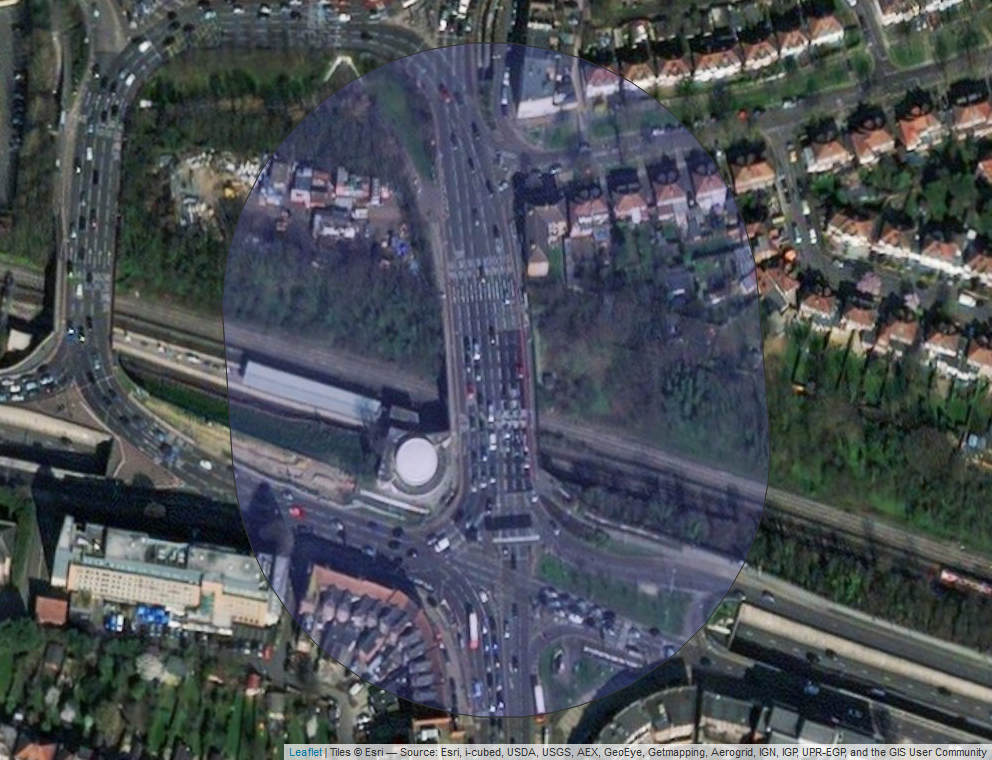

### Loading libraries
```{r load libraries, message=F, warning=F}
rm(list=ls(all=TRUE)) 

library(devtools)
#suppressMessages(devtools::install_github("r-spatial/sf"))
library(sf)
#suppressMessages(devtools::install_github("ropensci/osmdata"))
suppressMessages(library(osmdata))
suppressMessages(library(raster))
#suppressMessages(devtools::install_github("tidyverse/ggplot2"))
library(ggplot2)
library(rgeos)
library(maptools)
library(rgdal)
library(rgeos)
library(data.table)
library(knitr)
suppressMessages(library(mapview))
library(RCurl)
library(stplanr)
```


###  Import building height data

Building height data is downloaded from [Copernicus Urban Atlas](https://land.copernicus.eu/local/urban-atlas/building-height-2012?tab=mapview), unzipped and extracted.

The methodology for their creation, by [gaf.d])(https://www.gaf.de/), was as following: "Our original input data were Cartosat-1 acquisitions. The following processing system uses a customised and specialised semi-global matching algorithm to generate am 3m in close cooperation with DLR (German Aerospace Center). Subsequent to the highly automated DSM generation, a DTM was calculated and a nDSM (normalised Digital Surface Model) derived by using internal software and processing tools. The nDSM were finally resampled from 3m up to 10m resolution by using the maximum height value". 

This raster is then imported.

```{r get building rasters}

london_raster <- raster('buildings_raster/UK001L2_LONDON_UA2012_DHM/UK001L2_LONDON_UA2012_DHM.tif')
plot(london_raster)
title('Raster file of London Building heights')

plot(london_raster, xlim = c(3615000, 3625000), ylim = c(3200000, 3205000))
title('Raster file of London Building heights (zoomed)')

```

### Import OSM roads data

First we get the extent of the raster
```{r get extent of the raster}

extent              <- extent(london_raster)
extent              <- as(extent, 'SpatialPolygons')
proj4string(extent) <- crs(london_raster)
latlong             <- CRS("+init=epsg:4326")
extent              <- spTransform(extent, latlong)

min_x   <- extent(extent)[1]
max_x   <- extent(extent)[2]
min_y   <- extent(extent)[3]
max_y   <- extent(extent)[4]
rm(extent)
```

Now using the [osmdata package](https://cran.r-project.org/web/packages/osmdata/osmdata.pdf) we can download osmdata for the extent we just defined. Roads have the value 'highway' in [OpenStreetMap](https://en.wikipedia.org/wiki/OpenStreetMap). Within that heading, we can also filter using the following tags:

```{r download data from osm, warning=F}
available_tags('highway')
```

Now we import OSM roads data for the following road types.

```{r import road data}
primary           <- opq(bbox = c(min_x, min_y, max_x, max_y)) %>% add_osm_feature(key = 'highway', value='primary') %>% osmdata_sf()
primary           <- primary$osm_lines[,c('osm_id', 'oneway', 'lanes', 'geometry')]
primary$type      <- 'primary'

secondary         <- opq(bbox = c(min_x, min_y, max_x, max_y)) %>% add_osm_feature(key = 'highway', value='secondary') %>% osmdata_sf()
secondary         <- secondary$osm_lines[,c('osm_id', 'oneway', 'lanes', 'geometry')]
secondary$type    <- 'secondary'

motorway          <- opq(bbox = c(min_x, min_y, max_x, max_y)) %>% add_osm_feature(key = 'highway', value='motorway') %>% osmdata_sf()
motorway          <- motorway$osm_lines[,c('osm_id', 'oneway', 'lanes', 'geometry')]
motorway$type     <- 'motorway'

trunk             <- opq(bbox = c(min_x, min_y, max_x, max_y)) %>% add_osm_feature(key = 'highway', value='trunk') %>% osmdata_sf()
trunk             <- trunk$osm_lines[,c('osm_id', 'oneway', 'lanes', 'geometry')]
trunk$type        <- 'trunk'

tertiary          <- opq(bbox = c(min_x, min_y, max_x, max_y)) %>% add_osm_feature(key = 'highway', value='tertiary') %>% osmdata_sf()
tertiary          <- tertiary$osm_lines[,c('osm_id', 'oneway', 'lanes', 'geometry')]
tertiary$type     <- 'tertiary'
```

Then bind them all into one object

```{r bind_roads}
roads             <- rbind(primary, secondary, motorway, trunk, tertiary) 

roads$osm_id      <- as.numeric(as.character(roads$osm_id))

rm(primary, secondary, motorway, trunk, tertiary)

```

Now that we have a SpatialLinesDataFrame of all the London roads, we delete the ones where the 'lane' attribute is not formed properly or contains an error.

```{r clean lanes data}
roads$lanes       <- as.character(roads$lanes)
roads             <- roads[!grepl(';', roads$lanes),]
roads$lanes       <- as.numeric(roads$lanes)
```

The number of lanes for each road type is below.

```{r check lanes data}
table(roads$type, roads$lanes)

```

Where this is missing, we fill in the blanks, using the mean values of that road type, rounded.

```{r fill_empty_roads}

roads[roads$type == 'primary'     & is.na(roads$lanes),'lanes'] <- round(mean(roads[roads$type == 'primary'     & !is.na(roads$lanes),]$lanes),0)
roads[roads$type == 'secondary'   & is.na(roads$lanes),'lanes'] <- round(mean(roads[roads$type == 'secondary'   & !is.na(roads$lanes),]$lanes),0)
roads[roads$type == 'motorway'    & is.na(roads$lanes),'lanes'] <- round(mean(roads[roads$type == 'motorway'    & !is.na(roads$lanes),]$lanes),0)
roads[roads$type == 'trunk'       & is.na(roads$lanes),'lanes'] <- round(mean(roads[roads$type == 'trunk'       & !is.na(roads$lanes),]$lanes),0)
roads[roads$type == 'tertiary'    & is.na(roads$lanes),'lanes'] <- round(mean(roads[roads$type == 'tertiary'    & !is.na(roads$lanes),]$lanes),0)
```

Now, presuming that a lane is 3.15 metres wide, each road width is now calculated and added to the dataset. 

```{r road_widths}
roads$width             <- as.numeric(roads$lanes) * 3.15
```

OSM splits some roads into two, like Marylebone Road. This is a problem for calculating height to width ratios. So we are going to try and identify these.

```{r marylebone_issue}
roads$half_of_one <- NA

roads[roads$oneway == 'yes' & !is.na(roads$oneway) & roads$type == 'trunk' & !is.na(roads$type),'half_of_one'] <- as.character('Yes')
```

The road widths by road type are now as below

```{r road_widths_summary}

aggregate(width ~ type, data=roads, FUN=summary)

ggplot(roads, aes(y = width, x = type, group=type, fill=type)) + geom_boxplot() + ggtitle('Road widths by road type')
```

The widest road in the dataset is here
```{r checking roads}
m <- mapview(st_buffer(st_transform(roads[roads$width>25,][1,],27700),100), map.types = 'Esri.WorldImagery', alpha.regions=0.1)
mapshot(m, file = paste0(getwd(), "/map.png"), remove_controls = c("zoomControl", "layersControl", "homeButton","scaleBar"))
```



Pavement width is also added to the roads, depending on what type of road it is, as follows. Presumes 3 metres wide pavement

```{r add pavement widths}

roads$pavement_width   <- NA

roads[roads$type == 'primary'   & is.na(roads$half_of_one),  'pavement_width'] <- 6
roads[roads$type == 'secondary' & is.na(roads$half_of_one),  'pavement_width'] <- 6
roads[roads$type == 'motorway'  & is.na(roads$half_of_one),  'pavement_width'] <- 0
roads[roads$type == 'trunk'     & is.na(roads$half_of_one),  'pavement_width'] <- 6
roads[roads$type == 'tertiary'  & is.na(roads$half_of_one),  'pavement_width'] <- 6

roads[roads$type == 'primary'   & !is.na(roads$half_of_one) & roads$half_of_one == 'Yes', 'pavement_width'] <- 3
roads[roads$type == 'secondary' & !is.na(roads$half_of_one) & roads$half_of_one == 'Yes', 'pavement_width'] <- 3
roads[roads$type == 'motorway'  & !is.na(roads$half_of_one) & roads$half_of_one == 'Yes', 'pavement_width'] <- 0
roads[roads$type == 'trunk'     & !is.na(roads$half_of_one) & roads$half_of_one == 'Yes', 'pavement_width'] <- 3
roads[roads$type == 'tertiary'  & !is.na(roads$half_of_one) & roads$half_of_one == 'Yes', 'pavement_width'] <- 3

roads$total_width <- roads$width + roads$pavement_width
```

Add half central reservation
```{r}
roads[roads$half_of_one == 'Yes' & !is.na(roads$half_of_one),]$total_width <- roads[roads$half_of_one == 'Yes' & !is.na(roads$half_of_one),]$total_width + 2

```

With pavements added the roads width is..

```{r road widths summary with pavements}

aggregate(total_width ~ type, data=roads, FUN=summary)

ggplot(roads, aes(y = total_width, x = type, group=type, fill=type)) + geom_boxplot() + ggtitle('Road widths by road type')
```

The map below shows roads currently in the dataset, coloured by type

```{r show downloaded roads}
ggplot(roads, aes(colour = type, fill=type)) + 
  geom_sf() +
  ggtitle('Downloaded OSM roads, by road type') +
  theme(axis.text = element_blank(),
        panel.background = element_blank(),
        axis.ticks = element_blank(),
        legend.position = 'bottom')
```

Remove a few circular roads that are a problem for buffers

```{r remove problem roads}
roads_to_ignore         <- c(9393,11079,14595,15578)
roads                   <- roads[-roads_to_ignore,]
rm(roads_to_ignore)

```

Make the buffers around the roads

```{r make road buffers}
roads                   <- st_transform(roads, 27700)

roads$area              <- st_geometry(st_buffer(roads, dist = 15)) / st_geometry(st_buffer(roads, dist = 10))
```

For the roads like Marylebone Road, going to double and add 5 metres to the buffers.
```{r special_case}
roads[!is.na(roads$half_of_one),]$area              <- st_geometry(st_buffer(roads[!is.na(roads$half_of_one),], dist = 15*2+5)) /
                                                       st_geometry(st_buffer(roads[!is.na(roads$half_of_one),], dist = 10*2+5))
```

Transform the buffers to the same CRS as the raster we're going to extract from.
```{r buffers_transform}
roads$geometry          <- st_transform(roads$geometry,4326)
roads$area              <- st_transform(roads$area, 4326)

roads$geometry          <- st_transform(roads$geometry, crs(london_raster)@projargs)
roads$area              <- st_transform(roads$area, crs(london_raster)@projargs)

```

Check everything looks ok

```{r sanity_check}
plot(london_raster, xlim=c(3621000, 3622000), ylim = c(3204000,3205000))
plot(st_geometry(roads), xlim=c(3621000, 3622000), add=T)
plot(st_geometry(roads$area), xlim=c(3621000, 3622000), add=T)

```

Interactive map view of one feature

```{r map view of a buffer}
osm_id_to_examine <- 379356929

temp_raster <- extent(st_bbox(roads[roads$osm_id == osm_id_to_examine,])$xmin-40, st_bbox(roads[roads$osm_id == osm_id_to_examine,])$xmax+40, 
                      st_bbox(roads[roads$osm_id == osm_id_to_examine,])$ymin-40, st_bbox(roads[roads$osm_id == osm_id_to_examine,])$ymax+40)
temp_raster <- crop(london_raster, temp_raster)

mapview(temp_raster, alpha.regions = 0.4, map.types = 'OpenStreetMap.BlackAndWhite') %>% addFeatures(st_transform(roads[roads$osm_id == osm_id_to_examine,],4326))

rm(temp_raster, osm_id_to_examine)
```

Now extract the data we need from the raster (this takes circa 12 hours)

```{r extracting_heights}
start_time <- Sys.time()

road_polygons       <- as(roads$area,'Spatial')
roads$area          <- NULL 

roads$weighted_mean <- NA
roads$cell_count    <- NA
roads$zero_cells    <- NA

print('about extracting data')

extracted <- extract(london_raster, road_polygons, weights=T, na.rm=F)

print('extracted data, using sapply to put into the roads file')

roads$weighted_mean                           <- sapply(extracted, FUN = function(x)(sum(x[,1] * x[,2])))
roads$cell_count                              <- sapply(extracted, FUN = function(x)(length(x[,1])))
roads$zero_cells                              <- sapply(extracted, FUN = function(x)(sum(x[,1]==0)))
roads$max_height                              <- sapply(extracted, FUN = function(x)(max(x[,1], na.rm=T)))
roads$non_zero_means                          <- sapply(extracted, FUN = function(x)(sum(x[x[,1]>0,1] * (x[x[,1]>0,2] / sum(x[x[,1]>0,2])))))

roads[roads$max_height == '-Inf',]$max_height <- NA

print('done')

roads$geometry      <- st_transform(roads$geometry, 4326)

rm(london_raster)

end_time <- Sys.time()

print(end_time - start_time)

rm(start_time, end_time)
```

Now need to get the bearing of each road from start point to end point

```{r calculate bearing}

roads$bearing             <- line_bearing(roads)

hist(roads$bearing)

```

Where the road is 'half of one', double the width of the road

```{r double_width_for_half_roads}
roads[roads$half_of_one == 'Yes' & !is.na(roads$half_of_one),]$total_width <- roads[roads$half_of_one == 'Yes' & !is.na(roads$half_of_one),]$total_width * 2
```

Add another column for height to width ratio

```{r height and width ratio}
roads$height_width_ratio <- roads$weighted_mean / roads$total_width
```

Add another height widhth ratio column for when using the non-zero height from the raster

```{r add_another_height_width_ratio}
roads$height_width_ratio_excl_zeros <- roads$non_zero_means / roads$total_width
```

Now plot the non-zero height/width ratios.

```{r plot_the_non_zero_height_width_ratios}

ggplot(roads, aes(y = height_width_ratio, group=type, x=type, fill=type)) + geom_boxplot() + ggtitle('Height to width ratio by street type')

```


Need to classify the roads as canyons and directions for modelling. If the height is above 10 metres they will be classified as a low canyon, above 20, a  medium canyon, above 30 a high canyon + a specific directio.
```{r road_classification}
roads$classification     <- NA 

```

First the North-South canyon road type (type 1)

```{r north_south}

roads[roads$non_zero_means > 10 & roads$non_zero_means <= 20 & !is.na(roads$non_zero_means) & roads$bearing >= -22.5   & roads$bearing <= 22.5,]$classification    <- '1a'
roads[roads$non_zero_means > 10 & roads$non_zero_means <= 20 & !is.na(roads$non_zero_means) & roads$bearing >= 157.5   & roads$bearing <= 180,]$classification     <- '1a'
roads[roads$non_zero_means > 10 & roads$non_zero_means <= 20 & !is.na(roads$non_zero_means) & roads$bearing <= -157.5  & roads$bearing > -180,]$classification     <- '1a'


roads[roads$non_zero_means > 20 & roads$non_zero_means <= 30 & !is.na(roads$non_zero_means) & roads$bearing >= -22.5   & roads$bearing <= 22.5,]$classification  <- '1b'
roads[roads$non_zero_means > 20 & roads$non_zero_means <= 30 & !is.na(roads$non_zero_means) & roads$bearing >= 157.5   & roads$bearing <= 180,]$classification   <- '1b'
roads[roads$non_zero_means > 20 & roads$non_zero_means <= 30 & !is.na(roads$non_zero_means) & roads$bearing <= -157.5  & roads$bearing > -180,]$classification   <- '1b'

roads[roads$non_zero_means > 30 & !is.na(roads$non_zero_means) & roads$bearing >= -22.5   & roads$bearing <= 22.5,]$classification  <- '1c'
roads[roads$non_zero_means > 30 & !is.na(roads$non_zero_means) & roads$bearing >= 157.5   & roads$bearing <= 180,]$classification   <- '1c'
roads[roads$non_zero_means > 30 & !is.na(roads$non_zero_means) & roads$bearing <= -157.5  & roads$bearing > -180,]$classification   <- '1c'


```

Now the East-West canyon road type (type 2)

```{r east_west}
roads[roads$non_zero_means > 10 & roads$non_zero_means <= 20 & !is.na(roads$non_zero_means) & roads$bearing >= 67.5    & roads$bearing <= 112.5,]$classification <- '2a'
roads[roads$non_zero_means > 10 & roads$non_zero_means <= 20 & !is.na(roads$non_zero_means) & roads$bearing >= -112.5  & roads$bearing <= -67.5,]$classification <- '2a'

roads[roads$non_zero_means > 20 & roads$non_zero_means <= 30 & !is.na(roads$non_zero_means) & roads$bearing >= 67.5    & roads$bearing <= 112.5,]$classification <- '2b'
roads[roads$non_zero_means > 20 & roads$non_zero_means <= 30 & !is.na(roads$non_zero_means) & roads$bearing >= -112.5  & roads$bearing <= -67.5,]$classification <- '2b'

roads[roads$non_zero_means > 30 & !is.na(roads$non_zero_means) & roads$bearing >= 67.5    & roads$bearing <= 112.5,]$classification <- '2c'
roads[roads$non_zero_means > 30 & !is.na(roads$non_zero_means) & roads$bearing >= -112.5  & roads$bearing <= -67.5,]$classification <- '2c'

```

Now the South-East to North-West canyon road type (type 3)

```{r south_east_north_west}

roads[roads$non_zero_means > 10 & roads$non_zero_means <= 20 & !is.na(roads$non_zero_means) & roads$bearing >= 112.5    & roads$bearing <= 157.5,]$classification  <- '3a'
roads[roads$non_zero_means > 10 & roads$non_zero_means <= 20 & !is.na(roads$non_zero_means) & roads$bearing <= -22.5  & roads$bearing   >= -67.5,]$classification  <- '3a'

roads[roads$non_zero_means > 20 & roads$non_zero_means <= 30 & !is.na(roads$non_zero_means) & roads$bearing >= 112.5    & roads$bearing <= 157.5,]$classification  <- '3b'
roads[roads$non_zero_means > 20 & roads$non_zero_means <= 30 & !is.na(roads$non_zero_means) & roads$bearing <= -22.5  & roads$bearing   >= -67.5,]$classification  <- '3b'

roads[roads$non_zero_means > 30  & !is.na(roads$non_zero_means) & roads$bearing >= 112.5    & roads$bearing <= 157.5,]$classification  <- '3c'
roads[roads$non_zero_means > 30  & !is.na(roads$non_zero_means) & roads$bearing <= -22.5  & roads$bearing   >= -67.5,]$classification  <- '3c'

```

Now the South-West to North-East canyon road type (type 4)

```{r south_west_north_east}

roads[roads$non_zero_means > 10 & roads$non_zero_means <= 20 & !is.na(roads$non_zero_means) & roads$bearing >= 22.5    & roads$bearing  <= 67.5,]$classification   <- '4a'
roads[roads$non_zero_means > 10 & roads$non_zero_means <= 20 & !is.na(roads$non_zero_means) & roads$bearing <= -112.5  & roads$bearing >= -157.5,]$classification  <- '4a'

roads[roads$non_zero_means > 20 & roads$non_zero_means <= 30 & !is.na(roads$non_zero_means) & roads$bearing >= 22.5    & roads$bearing  <= 67.5,]$classification   <- '4b'
roads[roads$non_zero_means > 20 & roads$non_zero_means <= 30 & !is.na(roads$non_zero_means) & roads$bearing <= -112.5  & roads$bearing >= -157.5,]$classification  <- '4b'

roads[roads$non_zero_means > 30 & !is.na(roads$non_zero_means) & roads$bearing >= 22.5    & roads$bearing  <= 67.5,]$classification   <- '4c'
roads[roads$non_zero_means > 30 & !is.na(roads$non_zero_means) & roads$bearing <= -112.5  & roads$bearing >= -157.5,]$classification  <- '4c'

```

Now non-street-canyons that are open roads are classified as type 5. There are `r nrow(roads[roads$non_zero_means <= 1 & !is.na(roads$non_zero_means) ,])` of these.

```{r open_road}

roads[roads$non_zero_means <= 1 & !is.na(roads$non_zero_means) ,]$classification   <- 5 #open

```

Now non-street-canyons that are typical roads are classified as type 6. There are `r nrow(roads[roads$non_zero_means > 1 & roads$non_zero_means <= 10 & !is.na(roads$non_zero_means) ,])` of these.

```{r typical}

roads[roads$non_zero_means > 1 & roads$non_zero_means <= 10 & !is.na(roads$non_zero_means) ,]$classification    <- 6 #typical

```

Haven't been working on them, but think it's time time to add the residential roads back in and harmonise them with the main roads data.

```{r add_residential_roads}
residential           <- opq(bbox = c(min_x, min_y, max_x, max_y)) %>% add_osm_feature(key = 'highway', value='residential') %>% osmdata_sf()
residential           <- residential$osm_lines[,c('osm_id', 'oneway', 'lanes', 'geometry')]
residential$type      <- 'residential'

residential$osm_id      <- as.numeric(as.character(residential$osm_id))

residential$lanes       <- as.character(residential$lanes)
residential             <- residential[!grepl(';', residential$lanes),]
residential$lanes       <- as.numeric(residential$lanes)

residential[is.na(residential$lanes),'lanes'] <- 2

residential$width                           <- residential$lanes * 3.15
residential$half_of_one                     <- as.character(NA)
residential$pavement_width                  <- as.numeric(6)
residential$total_width                     <- as.numeric(residential$width + residential$pavement_width)
residential$weighted_mean                   <- as.numeric(NA)
residential$cell_count                      <- as.integer(NA)
residential$zero_cells                      <- as.integer(NA)
residential$bearing                         <- as.numeric(NA)
residential$height_width_ratio              <- as.numeric(NA)
residential$max_height                      <- as.numeric(NA)
residential$non_zero_means                  <- as.numeric(NA)
residential$height_width_ratio_excl_zeros   <- as.numeric(NA)
residential$classification                  <- as.numeric(6)

col_order <- names(roads)

residential <- residential[,col_order]

roads <- rbind(roads, residential)

rm(residential)

```

Now get the median height and width for each road type

```{r}

road_characteristics <- data.frame(aggregate(data = roads, cbind(total_width, non_zero_means) ~ classification, FUN=mean))

kable(road_characteristics)

```

```{r write_out_as_geojson}
st_write(roads, 'final_roads_london.geojson', delete_dsn = T)
```


```{r messing_about}

roads$type        <- as.character(roads$type)

roads[roads$type %in% c('primary', 'trunk'),'type']             <- 'primary'

roads[!roads$type %in% c('motorway','primary', 'trunk'),'type'] <- 'other'


```
